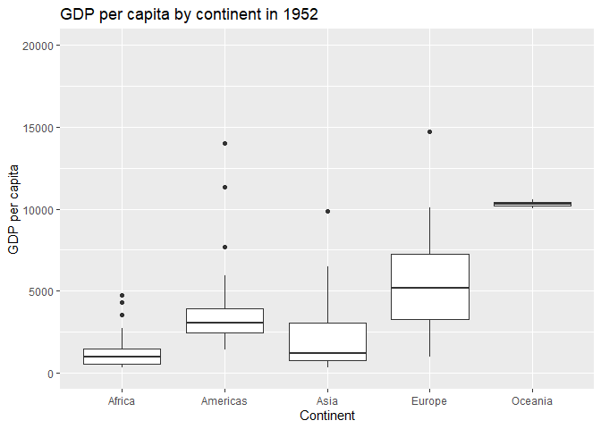
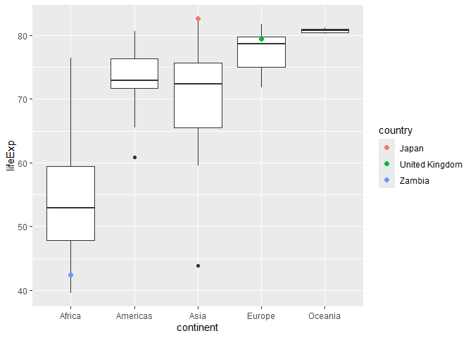
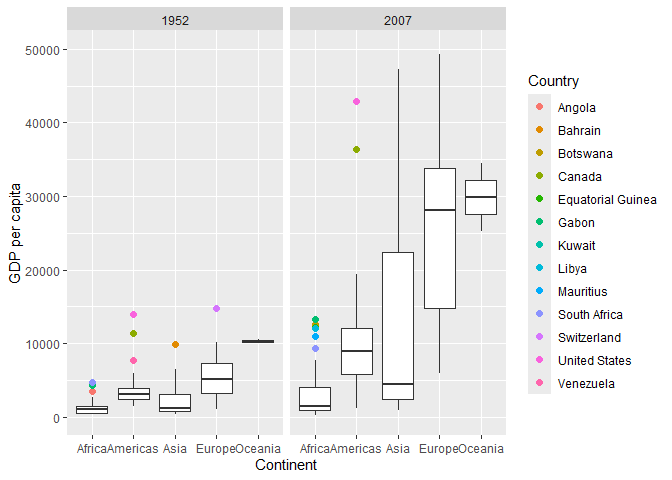
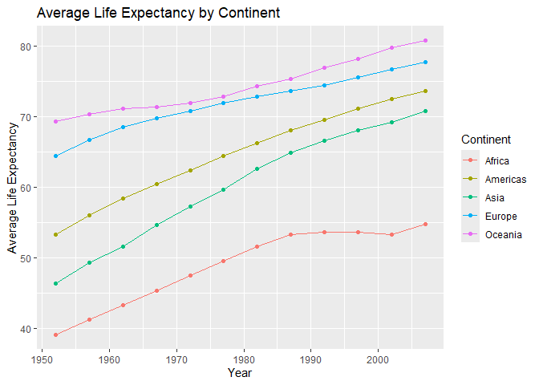
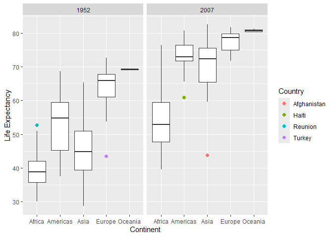
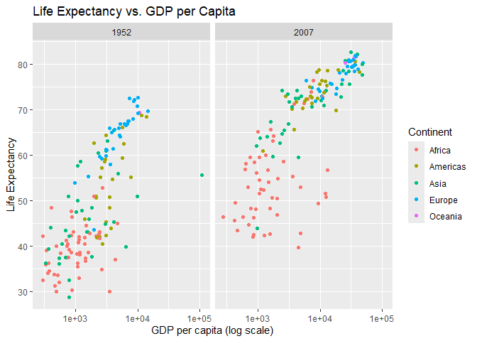

Gapminder
================
Joseph Vazhaeparampil
10-1-2026

- [Grading Rubric](#grading-rubric)
  - [Individual](#individual)
  - [Submission](#submission)
- [Guided EDA](#guided-eda)
  - [**q0** Perform your “first checks” on the dataset. What variables
    are in this
    dataset?](#q0-perform-your-first-checks-on-the-dataset-what-variables-are-in-this-dataset)
  - [**q1** Determine the most and least recent years in the `gapminder`
    dataset.](#q1-determine-the-most-and-least-recent-years-in-the-gapminder-dataset)
  - [**q2** Filter on years matching `year_min`, and make a plot of the
    GDP per capita against continent. Choose an appropriate `geom_` to
    visualize the data. What observations can you
    make?](#q2-filter-on-years-matching-year_min-and-make-a-plot-of-the-gdp-per-capita-against-continent-choose-an-appropriate-geom_-to-visualize-the-data-what-observations-can-you-make)
  - [**q3** You should have found *at least* three outliers in q2 (but
    possibly many more!). Identify those outliers (figure out which
    countries they
    are).](#q3-you-should-have-found-at-least-three-outliers-in-q2-but-possibly-many-more-identify-those-outliers-figure-out-which-countries-they-are)
  - [**q4** Create a plot similar to yours from q2 studying both
    `year_min` and `year_max`. Find a way to highlight the outliers from
    q3 on your plot *in a way that lets you identify which country is
    which*. Compare the patterns between `year_min` and
    `year_max`.](#q4-create-a-plot-similar-to-yours-from-q2-studying-both-year_min-and-year_max-find-a-way-to-highlight-the-outliers-from-q3-on-your-plot-in-a-way-that-lets-you-identify-which-country-is-which-compare-the-patterns-between-year_min-and-year_max)
- [Your Own EDA](#your-own-eda)
  - [**q5** Create *at least* three new figures below. With each figure,
    try to pose new questions about the
    data.](#q5-create-at-least-three-new-figures-below-with-each-figure-try-to-pose-new-questions-about-the-data)

*Purpose*: Learning to do EDA well takes practice! In this challenge
you’ll further practice EDA by first completing a guided exploration,
then by conducting your own investigation. This challenge will also give
you a chance to use the wide variety of visual tools we’ve been
learning.

<!-- include-rubric -->

# Grading Rubric

<!-- -------------------------------------------------- -->

Unlike exercises, **challenges will be graded**. The following rubrics
define how you will be graded, both on an individual and team basis.

## Individual

<!-- ------------------------- -->

| Category | Needs Improvement | Satisfactory |
|----|----|----|
| Effort | Some task **q**’s left unattempted | All task **q**’s attempted |
| Observed | Did not document observations, or observations incorrect | Documented correct observations based on analysis |
| Supported | Some observations not clearly supported by analysis | All observations clearly supported by analysis (table, graph, etc.) |
| Assessed | Observations include claims not supported by the data, or reflect a level of certainty not warranted by the data | Observations are appropriately qualified by the quality & relevance of the data and (in)conclusiveness of the support |
| Specified | Uses the phrase “more data are necessary” without clarification | Any statement that “more data are necessary” specifies which *specific* data are needed to answer what *specific* question |
| Code Styled | Violations of the [style guide](https://style.tidyverse.org/) hinder readability | Code sufficiently close to the [style guide](https://style.tidyverse.org/) |

## Submission

<!-- ------------------------- -->

Make sure to commit both the challenge report (`report.md` file) and
supporting files (`report_files/` folder) when you are done! Then submit
a link to Canvas. **Your Challenge submission is not complete without
all files uploaded to GitHub.**

``` r
library(tidyverse)
```

    ## ── Attaching core tidyverse packages ──────────────────────── tidyverse 2.0.0 ──
    ## ✔ dplyr     1.2.1     ✔ readr     2.2.0
    ## ✔ forcats   1.0.1     ✔ stringr   1.6.0
    ## ✔ ggplot2   4.0.3     ✔ tibble    3.3.1
    ## ✔ lubridate 1.9.5     ✔ tidyr     1.3.2
    ## ✔ purrr     1.2.2     
    ## ── Conflicts ────────────────────────────────────────── tidyverse_conflicts() ──
    ## ✖ dplyr::filter() masks stats::filter()
    ## ✖ dplyr::lag()    masks stats::lag()
    ## ℹ Use the conflicted package (<http://conflicted.r-lib.org/>) to force all conflicts to become errors

``` r
library(gapminder)
```

*Background*: [Gapminder](https://www.gapminder.org/about-gapminder/) is
an independent organization that seeks to educate people about the state
of the world. They seek to counteract the worldview constructed by a
hype-driven media cycle, and promote a “fact-based worldview” by
focusing on data. The dataset we’ll study in this challenge is from
Gapminder.

# Guided EDA

<!-- -------------------------------------------------- -->

First, we’ll go through a round of *guided EDA*. Try to pay attention to
the high-level process we’re going through—after this guided round
you’ll be responsible for doing another cycle of EDA on your own!

### **q0** Perform your “first checks” on the dataset. What variables are in this dataset?

``` r
## TASK: Do your "first checks" here!
glimpse(gapminder)
```

    ## Rows: 1,704
    ## Columns: 6
    ## $ country   <fct> "Afghanistan", "Afghanistan", "Afghanistan", "Afghanistan", …
    ## $ continent <fct> Asia, Asia, Asia, Asia, Asia, Asia, Asia, Asia, Asia, Asia, …
    ## $ year      <int> 1952, 1957, 1962, 1967, 1972, 1977, 1982, 1987, 1992, 1997, …
    ## $ lifeExp   <dbl> 28.801, 30.332, 31.997, 34.020, 36.088, 38.438, 39.854, 40.8…
    ## $ pop       <int> 8425333, 9240934, 10267083, 11537966, 13079460, 14880372, 12…
    ## $ gdpPercap <dbl> 779.4453, 820.8530, 853.1007, 836.1971, 739.9811, 786.1134, …

``` r
summary(gapminder)
```

    ##         country        continent        year         lifeExp     
    ##  Afghanistan:  12   Africa  :624   Min.   :1952   Min.   :23.60  
    ##  Albania    :  12   Americas:300   1st Qu.:1966   1st Qu.:48.20  
    ##  Algeria    :  12   Asia    :396   Median :1980   Median :60.71  
    ##  Angola     :  12   Europe  :360   Mean   :1980   Mean   :59.47  
    ##  Argentina  :  12   Oceania : 24   3rd Qu.:1993   3rd Qu.:70.85  
    ##  Australia  :  12                  Max.   :2007   Max.   :82.60  
    ##  (Other)    :1632                                                
    ##       pop              gdpPercap       
    ##  Min.   :6.001e+04   Min.   :   241.2  
    ##  1st Qu.:2.794e+06   1st Qu.:  1202.1  
    ##  Median :7.024e+06   Median :  3531.8  
    ##  Mean   :2.960e+07   Mean   :  7215.3  
    ##  3rd Qu.:1.959e+07   3rd Qu.:  9325.5  
    ##  Max.   :1.319e+09   Max.   :113523.1  
    ## 

**Observations**:

- Country
- COntinent
- Year
- Life Expectancy
- Population
- GDP per capita

### **q1** Determine the most and least recent years in the `gapminder` dataset.

*Hint*: Use the `pull()` function to get a vector out of a tibble.
(Rather than the `$` notation of base R.)

``` r
## TASK: Find the largest and smallest values of `year` in `gapminder`
year_max <- max(gapminder |> pull(year))
year_min <- min(gapminder |> pull(year))
```

Use the following test to check your work.

``` r
## NOTE: No need to change this
assertthat::assert_that(year_max %% 7 == 5)
```

    ## [1] TRUE

``` r
assertthat::assert_that(year_max %% 3 == 0)
```

    ## [1] TRUE

``` r
assertthat::assert_that(year_min %% 7 == 6)
```

    ## [1] TRUE

``` r
assertthat::assert_that(year_min %% 3 == 2)
```

    ## [1] TRUE

``` r
if (is_tibble(year_max)) {
  print("year_max is a tibble; try using `pull()` to get a vector")
  assertthat::assert_that(False)
}

print("Nice!")
```

    ## [1] "Nice!"

### **q2** Filter on years matching `year_min`, and make a plot of the GDP per capita against continent. Choose an appropriate `geom_` to visualize the data. What observations can you make?

You may encounter difficulties in visualizing these data; if so document
your challenges and attempt to produce the most informative visual you
can.

``` r
## TASK: Create a visual of gdpPercap vs continent

q2 <- gapminder |>
  filter(year == year_min)

ggplot(q2, aes(x = continent, y = gdpPercap)) +
  geom_boxplot() +
  coord_cartesian(ylim = c(0, 20000)) +
  labs(
    x = "Continent",
    y = "GDP per capita",
    title = paste("GDP per capita by continent in", year_min)
  )
```

<!-- -->

**Observations**:

- Africa generally had the lowest GDP per capita, although there were
  definitely some variation
- Oceania seems to have the highest GDP per capita but was absed on a
  very samll number of datapoints, there is little variation
- Europe seems to have the largest amount of variation in GDP per capita
  (Standard deviation & range)

**Difficulties & Approaches**:

- Write your challenges and your approach to solving them
  - The graph was initially not scaled well on the y-axis
  - We can observe the presence of several outliers, indicated by dots
    in the box plot

### **q3** You should have found *at least* three outliers in q2 (but possibly many more!). Identify those outliers (figure out which countries they are).

``` r
## TASK: Identify the outliers from q2
q2 |>
  group_by(continent) |>
  mutate(
    Q1 = quantile(gdpPercap, 0.25),
    Q3 = quantile(gdpPercap, 0.75),
    IQR = Q3 - Q1,
    outlier = gdpPercap < Q1 - 1.5 * IQR |
      gdpPercap > Q3 + 1.5 * IQR
  ) |>
  filter(outlier) |>
  select(country, continent, gdpPercap)
```

    ## # A tibble: 9 × 3
    ## # Groups:   continent [4]
    ##   country       continent gdpPercap
    ##   <fct>         <fct>         <dbl>
    ## 1 Angola        Africa        3521.
    ## 2 Bahrain       Asia          9867.
    ## 3 Canada        Americas     11367.
    ## 4 Gabon         Africa        4293.
    ## 5 Kuwait        Asia        108382.
    ## 6 South Africa  Africa        4725.
    ## 7 Switzerland   Europe       14734.
    ## 8 United States Americas     13990.
    ## 9 Venezuela     Americas      7690.

**Observations**:

- Identify the outlier countries from q2
  - We can see clearly that the outliers listed in the table are whats
    listed as outliers in the box plot

*Hint*: For the next task, it’s helpful to know a ggplot trick we’ll
learn in an upcoming exercise: You can use the `data` argument inside
any `geom_*` to modify the data that will be plotted *by that geom
only*. For instance, you can use this trick to filter a set of points to
label:

``` r
## NOTE: No need to edit, use ideas from this in q4 below
gapminder %>%
  filter(year == max(year)) %>%

  ggplot(aes(continent, lifeExp)) +
  geom_boxplot() +
  geom_point(
    data = . %>% filter(country %in% c("United Kingdom", "Japan", "Zambia")),
    mapping = aes(color = country),
    size = 2
  )
```

<!-- -->

### **q4** Create a plot similar to yours from q2 studying both `year_min` and `year_max`. Find a way to highlight the outliers from q3 on your plot *in a way that lets you identify which country is which*. Compare the patterns between `year_min` and `year_max`.

*Hint*: We’ve learned a lot of different ways to show multiple
variables; think about using different aesthetics or facets.

``` r
## TASK: Create a visual of gdpPercap vs continent
q4 <- gapminder |>
  filter(year %in% c(year_min, year_max))

ggplot(q4, aes(x = continent, y = gdpPercap)) +
  geom_boxplot(outlier.shape = NA) +
  coord_cartesian(ylim = c(0, 50000)) +
  geom_point(
    data = q4 |>
      group_by(year, continent) |>
      mutate(
        Q1 = quantile(gdpPercap, 0.25),
        Q3 = quantile(gdpPercap, 0.75),
        IQR = Q3 - Q1,
        outlier = gdpPercap < Q1 - 1.5 * IQR |
          gdpPercap > Q3 + 1.5 * IQR
      ) |>
      filter(outlier),
    aes(color = country),
    size = 2
  ) +
  facet_wrap(~year) +
  labs(
    x = "Continent",
    y = "GDP per capita",
    color = "Country"
  )
```

<!-- -->

**Observations**:

- The United States is a consistent outlier in both 1952 and 2007 for
  GDP per cpaita in the Americas
- The range of GDP per capita has increased dramatically across all
  continents, but particularly the standard deviation in Africa and Asia

# Your Own EDA

<!-- -------------------------------------------------- -->

Now it’s your turn! We just went through guided EDA considering the GDP
per capita at two time points. You can continue looking at outliers,
consider different years, repeat the exercise with `lifeExp`, consider
the relationship between variables, or something else entirely.

### **q5** Create *at least* three new figures below. With each figure, try to pose new questions about the data.

``` r
## TASK: Your first graph
gapminder |>
  group_by(year, continent) |>
  summarize(avg_lifeExp = mean(lifeExp)) |>
  ggplot(aes(x = year, y = avg_lifeExp, color = continent)) +
  geom_line() +
  geom_point() +
  labs(
    title = "Average Life Expectancy by Continent",
    x = "Year",
    y = "Average Life Expectancy",
    color = "Continent"
  )
```

    ## `summarise()` has regrouped the output.
    ## ℹ Summaries were computed grouped by year and continent.
    ## ℹ Output is grouped by year.
    ## ℹ Use `summarise(.groups = "drop_last")` to silence this message.
    ## ℹ Use `summarise(.by = c(year, continent))` for per-operation grouping
    ##   (`?dplyr::dplyr_by`) instead.

<!-- -->

- Average life expectancy seems to have increased across all of the
  continents
- Africa seems so have stopped increasing ~1987 and plateaued in terms
  of life expectancy
- It’s slightly surprising to me how Oceania tops the list, but makes me
  wonder if we are not seeing the full picture with only 2 countries in
  Oceania. I wonder what it woudl look like if we had more datapoitns
  from the pacific island countries nearby Oceania.

``` r
## TASK: Your second graph

q5 <- gapminder |>
  filter(year %in% c(year_min, year_max))

ggplot(q5, aes(x = continent, y = lifeExp)) +
  geom_boxplot(outlier.shape = NA) +
  geom_point(
    data = q5 |>
      group_by(year, continent) |>
      mutate(
        Q1 = quantile(lifeExp, 0.25),
        Q3 = quantile(lifeExp, 0.75),
        IQR = Q3 - Q1,
        outlier = lifeExp < Q1 - 1.5 * IQR |
          lifeExp > Q3 + 1.5 * IQR
      ) |>
      filter(outlier),
    aes(color = country),
    size = 2
  ) +
  facet_wrap(~year) +
  labs(
    x = "Continent",
    y = "Life Expectancy",
    color = "Country"
  )
```

<!-- -->

- Afghanistan has a significantly lower life expectancy than the other
  countries in Asia in 2007 (perhaps due to political turmoil?)
- We observe dramatic increase in life expectancy in Asia and the
  Americas relative to the other continents
- Turkey seems to have recovered from a really low life expectancy
  relative to other Asian countries in the 50s. External research
  indicates that this may b e sue to lack of health infracture and the
  rampant spread of diseases in the post-WWII recovery era.

``` r
q5 <- gapminder |>
  filter(year %in% c(year_min, year_max))

ggplot(q5, aes(x = gdpPercap, y = lifeExp, color = continent)) +
  geom_point() +
  scale_x_log10() +
  facet_wrap(~year) +
  labs(
    title = "Life Expectancy vs. GDP per Capita",
    x = "GDP per capita (log scale)",
    y = "Life Expectancy",
    color = "Continent"
  )
```

<!-- -->

- It seems pretty clear that higher GDP tends to be asociateed with
  higher life expectancy, especially more so in 2007 and in Europe,
  Asia, and the Americas
- It’s surprising to me that several African countries with average GDPs
  per capita compared to the rest of the world still have some of the
  lowest life expectancy - makes me wonder about the welath distribution
  in these countries and who the GDP per capita actually benefits
- THis was my favorite graph as I think it reveleaded several
  interesting things that could be interesting to look further into
